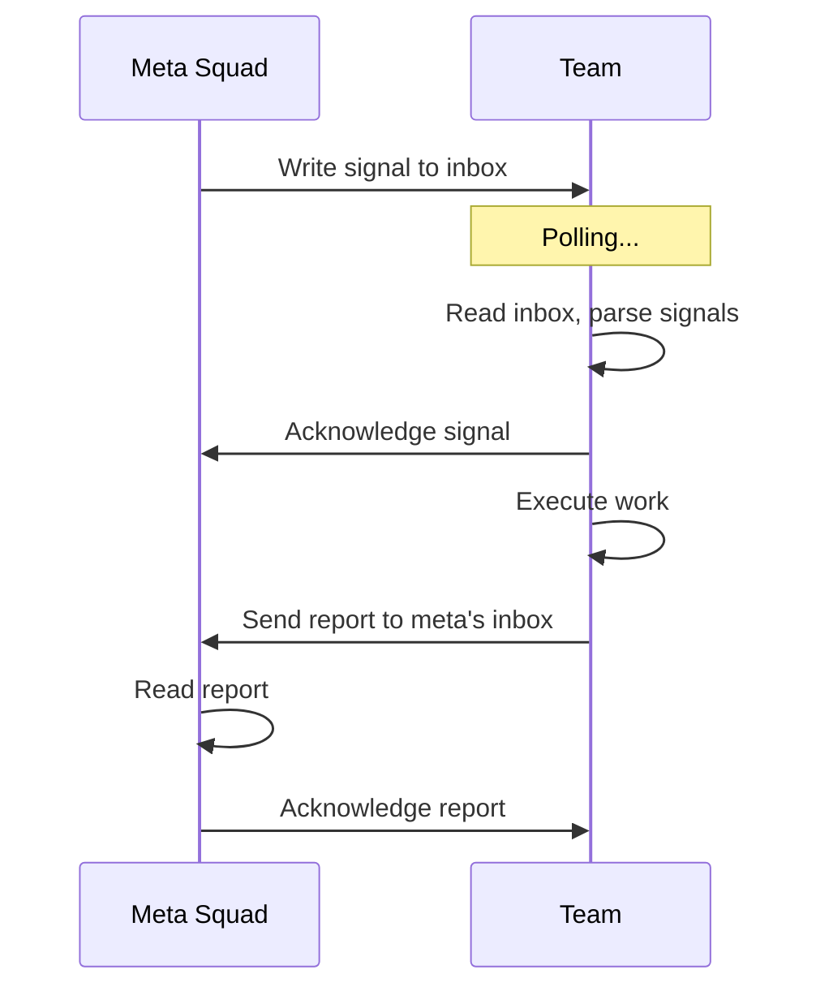

# Signal Protocol

Teams communicate via **signals**—typed messages for directives, questions, reports, and alerts. The built-in transport is **file-based** (`file-signal-v1`). Teams notifications (e.g., via Microsoft Teams) are a meta-only notification channel, not a signal transport.

## Signal Message Format

All signals share a common structure:

```typescript
interface SignalMessage {
  id: string;                 // Unique identifier (UUID)
  timestamp: string;          // ISO 8601 creation time
  from: string;               // Sender team ID (or 'meta' for meta-squad)
  to: string;                 // Recipient team ID (or 'meta')
  type: 'directive' | 'question' | 'report' | 'alert';
  subject: string;            // Short summary
  body: string;               // Full message content
  protocol: string;           // 'file-signal-v1'
  acknowledged?: boolean;     // Has recipient seen this?
  acknowledged_at?: string;   // When acknowledgment occurred
}
```

### Message Types

#### `directive`

Instructs a team to perform work.

**Example:**
```json
{
  "id": "msg-123",
  "timestamp": "2025-01-30T12:00:00Z",
  "from": "meta",
  "to": "backend-api",
  "type": "directive",
  "subject": "Implement user authentication",
  "body": "Build JWT-based auth with login, logout, and token refresh endpoints.",
  "protocol": "file-signal-v1"
}
```

#### `question`

Requests information from another team.

**Example:**
```json
{
  "id": "msg-456",
  "timestamp": "2025-01-30T12:05:00Z",
  "from": "frontend-team",
  "to": "backend-api",
  "type": "question",
  "subject": "Auth endpoint URL?",
  "body": "What's the base URL for the authentication API?",
  "protocol": "file-signal-v1"
}
```

#### `report`

Shares findings or status updates.

**Example:**
```json
{
  "id": "msg-789",
  "timestamp": "2025-01-30T12:30:00Z",
  "from": "backend-api",
  "to": "meta",
  "type": "report",
  "subject": "Auth implementation complete",
  "body": "JWT auth is implemented and tested. See deliverable.md for details.",
  "protocol": "file-signal-v1"
}
```

#### `alert`

Raises an error or blocking issue.

**Example:**
```json
{
  "id": "msg-abc",
  "timestamp": "2025-01-30T12:35:00Z",
  "from": "backend-api",
  "to": "meta",
  "type": "alert",
  "subject": "Build failed",
  "body": "TypeScript compilation error in src/auth.ts:42. Cannot proceed.",
  "protocol": "file-signal-v1"
}
```

## File-Based Protocol (`file-signal-v1`)

Signals are JSON files in `.squad/signals/` directories.

### Directory Structure

```
.squad/
  signals/
    inbox/              ← Messages sent TO this team
      {timestamp}-{type}-{subject}.json
      {timestamp}-{type}-{subject}.json.ack
    outbox/             ← Messages sent FROM this team
      {timestamp}-{type}-{subject}.json
```

### File Naming

Format: `{timestamp}-{type}-{subject}.json`

**Example:** `2025-01-30T120000Z-directive-implement-auth.json`

**Rules:**
- Timestamp is ISO 8601 without colons (safe for filesystems)
- Subject is kebab-cased
- Extension is `.json`

### Signal File Contents

Exactly the `SignalMessage` JSON structure:

```json
{
  "id": "msg-123",
  "timestamp": "2025-01-30T12:00:00Z",
  "from": "meta",
  "to": "backend-api",
  "type": "directive",
  "subject": "Implement user authentication",
  "body": "Build JWT-based auth with login, logout, and token refresh endpoints.",
  "protocol": "file-signal-v1"
}
```

### Acknowledgment

When a team reads a signal, it creates a `.json.ack` file:

**File:** `{signal-file}.ack`

**Contents:**
```json
{
  "acknowledged": true,
  "acknowledged_at": "2025-01-30T12:05:00Z"
}
```

### Reading Signals

Teams scan `inbox/` directory:
1. List `.json` files
2. Parse each as `SignalMessage`
3. Filter by `to` field (match team ID)
4. Return array of signals

### Writing Signals

To send a signal:
1. Generate unique ID (UUID)
2. Create `SignalMessage` object
3. Write to recipient's `inbox/` as JSON
4. Write to own `outbox/` for record

## Signal Lifecycle



### Steps

1. **Send:** Sender writes signal to recipient's inbox
2. **Poll:** Recipient periodically checks inbox
3. **Acknowledge:** Recipient marks signal as read
4. **Process:** Recipient acts on signal
5. **Respond:** (Optional) Recipient sends reply signal

## Best Practices

### Subject Lines

Keep short and descriptive:

✅ **Good:** `Implement password reset`

❌ **Bad:** `Please could you maybe work on implementing the password reset feature when you get a chance`

### Body Content

Be specific and actionable:

✅ **Good:**
```
Build password reset flow with:
- POST /auth/reset-request (email → send token)
- POST /auth/reset-password (token + new password)
- 1-hour token expiration
- Email template in templates/password-reset.html
```

❌ **Bad:**
```
Do the password reset thing
```

### Signal Types

Choose the right type:

- **directive** when assigning work
- **question** when requesting info
- **report** when sharing results
- **alert** when blocked or errors occur

### Acknowledgments

Always acknowledge signals you receive—even if just to confirm receipt. This prevents duplicate signals or uncertainty about whether a message was seen.

## Next Steps

- [View SDK types](/vladi-plugins-marketplace/reference/sdk-types)
- [Understand configuration](/vladi-plugins-marketplace/reference/configuration)
- [Explore scripts reference](/vladi-plugins-marketplace/reference/scripts)
